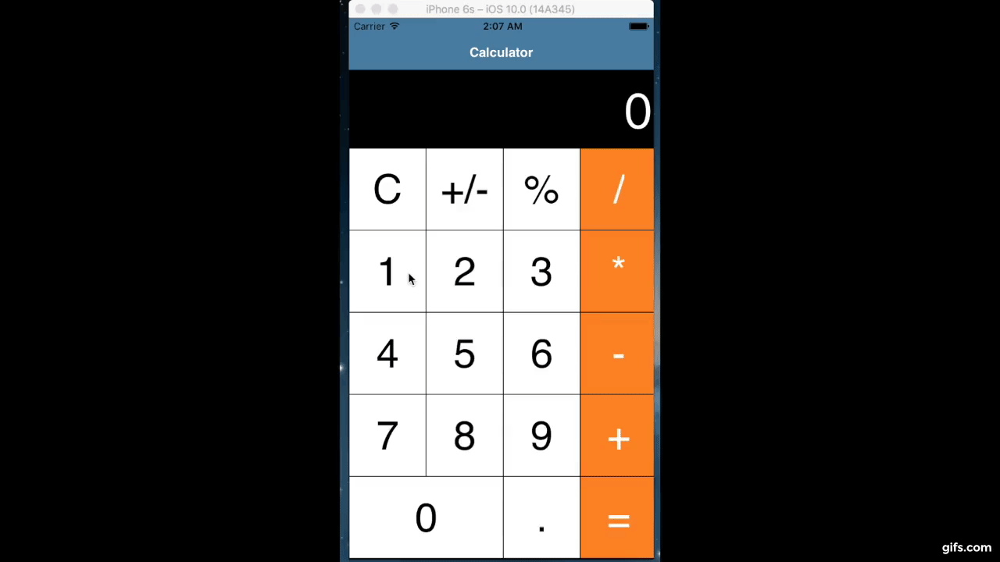
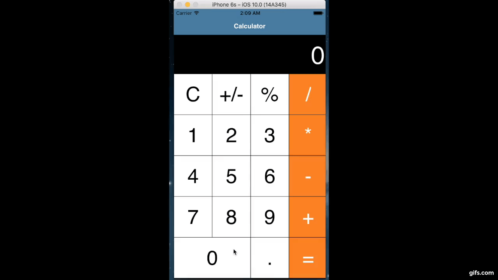
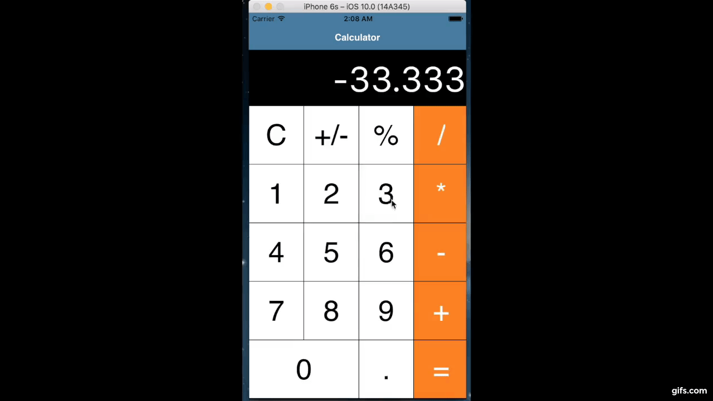

# Homework 2: Swifty Calculator

## Due
Wednesday, October 3rd at 11:59 PM

## Description
In your first homework assignment, you learned the basics of types, functions, and classes in Swift 3.0 via the Xcode Playground. Our lectures thereafter have introduced you to the MVC pattern, how to perform UI updates and seques (e.g. `label.text = 'foo'`, `pushViewController`), and now you will be putting these techniques together to build a working calculator.

But, wait -- who would want to add all those buttons to the storyboard and connect them to their appropriate delegate methods? There's got to be a better way!

Thankfully, your instructors have provided the basic UI and action selectors in your project skeleton. You will be primarily responsible for writing the logic (the brains) of the calculator app. 

As an added bonus, there are 4 test suites (see `SwiftCalcUITests`) to test your implementation. These test suites form a subset of the tests we will be using to grade your app on behavior and functionality. In order to run a test in Xcode, you can click on the ◇ button to the left of any XCTestCase, or open the Test Navigator and click the ▶ button. For more information on Unit Tests, [read the documentation](https://developer.apple.com/library/content/documentation/ToolsLanguages/Conceptual/Xcode_Overview/UnitTesting.html#//apple_ref/doc/uid/TP40010215-CH63-SW1).

By the end of this project, you will have learned how to update UI elements in response to user interaction, the basics of the Swift 3.0 language through implementing a subset of the iOS calculator features, and the fundamentals of TDD in Xcode8.

## Instructions
**Create a working calculator**. In any cases of uncertainty on how to update `resultLabel`, follow the behavior of the iOS calculator.

### 1.  Required Behaviors  (See `GeneralCalcUITests`)
  - [ ] a. `resultLabel` can hold a max of 7 characters 
  - [ ] b. Pressing a number button updates the `resultLabel` (if a user action would violate rule a, ignore that action)
  - [ ] c. `resultLabel` displays the correct value (the current number being entered, or the result of a calculation)
  - [ ] d. `C` button resets `resultLabel` to `0`
  - [ ] e. `+/-` flips the sign of the input
  - [ ] f. `=` updates the `resultLabel` with the resulting calculation

### 2. Basic Operations (See `BasicCalcUITests`)
  - [ ] a. Support addition between single-digit integers
  - [ ] b. Support subtraction between single-digit integers
  - [ ] c. Support multiplication between single-digit integers
  - [ ] d. Support division between any two integers

### 3.  Intermediate Operations (See `IntermediateCalcUITests`)
  - [ ] a. Consecutive operations will update `resultLabel` as though the `=` button was pressed prior (after pressing the buttons [`1`,`+`,`2`,`+`] `resultLabel` should read `3`. Then, after pressing [`4`, `=`], `resultLabel` should read `7`)
  - [ ] b. Support successive addition and subtraction operations on integers
  - [ ] c. Support valid sequences of operations on integers (pressing [`2`,`+`, `-`, `\`, `*`, `3`,`=`] should produce `6`)

### 4. Advanced Operations (See `AdvancedCalcUITests`)
  - [ ] a. Division produces `Double`s instead of `Int`s where appropriate
  - [ ] b. Display an `Int` when the `Double` result is equivalent to an `Int` of valid size 
  - [ ] c. Support the entry and operations of `Decimal`s (see the `prettyOutput` computed property in `BaseExtension`)
  - [ ] d. Support Scientific Notation for very large or very small results (`1000000 * 25 -> 2.5e7`, `9 / 4000000 -> 2.25e-6`)

### Bells & Whistles
1. Make the calculator look more aesthetic (update buttons styles) 
2. Add a landscape view like the iOS calculator
3. Present an [alert](https://developer.apple.com/reference/uikit/uiviewcontroller/1621428-popoverpresentationcontroller) if user performs an invalid action (e.g. divides by zero)

## Grading

Grading is based on how many autograder tests you pass. We provided all autograder tests in the *UITests group. You get assigned 1 point for every set of tests you passed. Note that if you don't pass Required Behaviors, you automatically get an F. You get a total score out of 4. For context a 0/4 and 1/4 - F, 2/4 - D, 3/4 - C, 4/4 - B.

We reserve the top submissions for the top students in the class. These students will get a 5/4 and will be passed on to Apple recruiting. 

## Video Demos

### Integer Calculator

### Double Calculator

### Double Calculator with Scientific Notation

